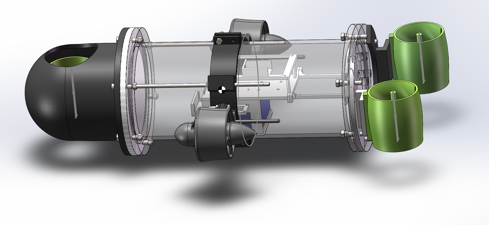
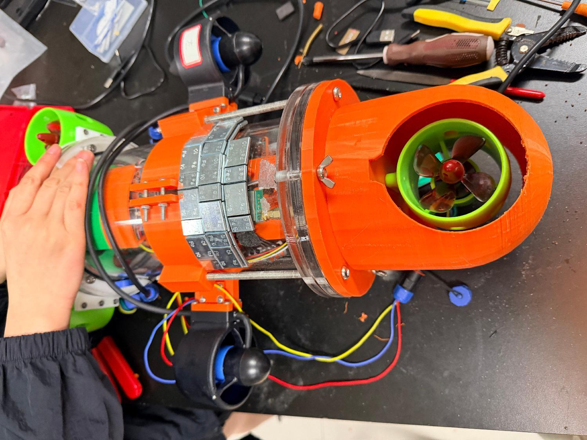
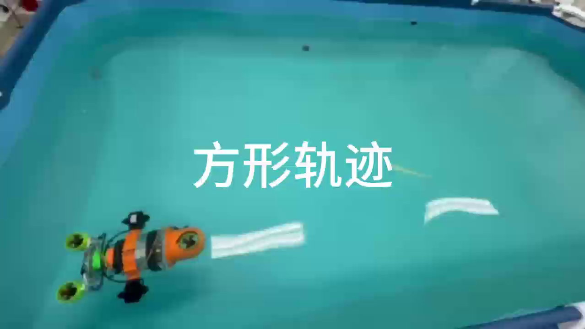
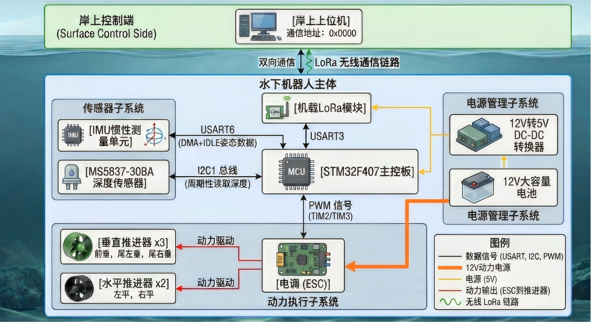

# Five-Propeller Underwater Robot

[简体中文](README.zh-CN.md)

[](LICENSE)


An STM32F407/FreeRTOS course project for a small underwater robot with three vertical and two horizontal thrusters. The repository brings the firmware, SolidWorks design, PC LoRa tool, Python 6-DOF simulation, ROS1 model, prototype images, and engineering notes together as reviewable source files.



> [!CAUTION]
> This is a teaching/research prototype, not a certified underwater vehicle. The current depth conversion appears approximately 10× too small and active modes do not yet have a LoRa command-loss watchdog. Read [Safety and known limitations](docs/safety.md) before powering thrusters or attempting closed-loop water tests.

## What the prototype demonstrates

- Five-thruster actuation: three vertical units for heave/pitch/roll and two horizontal units for surge/yaw.
- `IDLE`, depth `HOVER`, heading-hold `AUTO`, absolute-yaw `TURN`, and timed `SQUARE` modes.
- Four firmware PID loops with an analytic mixer and proportional saturation handling.
- FreeRTOS separation of control, pressure sampling, communication, and heartbeat work.
- H30 serial IMU, MS5837-30BA pressure sensor, E22-400T30D LoRa, five ESC PWM channels, and 2 Hz telemetry.
- Python/pyserial command console with live status and CSV logging.
- Standalone Python 6-DOF task simulation and ROS1 URDF/STL visualization.

## Prototype and pool test

| Final assembly | Square-path test frame |
| --- | --- |
|  |  |

The course report records demonstrations of depth control, straight motion, turning, and a timed square sequence. These tests establish prototype feasibility; they do not establish a pressure rating, navigation accuracy, or safety certification.

## System overview



| Layer | Main components | Responsibility |
| --- | --- | --- |
| Sensors | H30 IMU, MS5837-30BA | Attitude, acceleration, pressure, and depth |
| Controller | STM32F407 + FreeRTOS | State machine, PID, mixing, communication |
| Actuation | 5 ESC-driven thrusters | Heave, pitch, roll, surge, and yaw |
| Communication | E22 LoRa over UART/DMA | Commands and telemetry |
| Ground station | Python + pyserial | Command entry, display, and CSV logging |
| Numerical simulation | Python + NumPy/Matplotlib | 6-DOF model and repeatable task examples |
| Robot visualization | ROS1 URDF/STL | Geometry and joint display |

## Hardware snapshot

The report lists an STM32F407, H30 IMU, MS5837-B30 sensor, E22-400T30D radio, a custom Samsung 21700-50S battery pack, two installed Viocean T60 horizontal thrusters, three vertical thrusters, and a 130 mm × 250 mm transparent housing. Its historical project total is CNY 2,441.3. See [Hardware and budget](docs/hardware.md) for quantities, the spare-thruster discrepancy, and missing electrical documentation.

## Repository layout

```text
Five-Propeller-Underwater-Robot/
├─ firmware/                 STM32F407 CubeMX/CMake firmware
├─ tools/pc/                 Python LoRa console and telemetry logger
├─ mechanical/solidworks/    Native SolidWorks parts and assemblies
├─ simulation/python/        Standalone 6-DOF numerical simulation
├─ simulation/ros/           ROS1 URDF/STL visualization package
├─ docs/                     Architecture, algorithms, protocol, hardware, review
├─ .github/                  Issue and pull-request templates
├─ README.md
├─ README.zh-CN.md
└─ LICENSE
```

The two original ZIP archives were replaced by their source trees so GitHub can browse, search, diff, and review the project directly.

## Quick start

### 1. Inspect or build the firmware

Requirements: CMake 3.22+, Ninja, and Arm GNU Toolchain (`arm-none-eabi-gcc`).

```bash
cd firmware
cmake --preset Debug
cmake --build --preset Debug
```

Use STM32CubeMX to inspect or regenerate `firmware/unify_v1_0307.ioc`. Pin assignments, wiring, PWM neutral/range, sensor configuration, motor direction, and safety limits must be verified against the actual hardware before flashing. See [Firmware notes](firmware/README.md).

### 2. Run the PC LoRa console

```bash
python -m venv .venv
# Windows PowerShell: .venv\Scripts\Activate.ps1
python -m pip install -r tools/pc/requirements.txt
python tools/pc/lora_pc.py COM6 9600
```

Replace `COM6` and `9600` with the real port and configured baud rate. See [PC tool instructions](tools/pc/README.md) and the [protocol specification](docs/protocol.md).

### 3. Run the numerical simulation

```bash
cd simulation/python
python -m pip install -r requirements.txt
python scripts/smoke_test.py
python run_all_tasks.py
```

Simulation parameters are provisional engineering assumptions. Numerical errors—especially very small depth RMSE values—must not be presented as measured vehicle accuracy. See [Simulation notes](simulation/python/README.md).

### 4. View the ROS model

Place `simulation/ros/simulatedrobot` in a ROS1 catkin workspace and run:

```bash
roslaunch simulatedrobot display_fixed.launch
```

The package is a geometry visualization export, not a validated underwater Gazebo model. See [ROS/URDF notes](simulation/ros/README.md).

## Firmware control modes

| Mode | Behavior |
| --- | --- |
| `IDLE` | Neutral PWM and reset all PID state |
| `HOVER` | Hold target depth, level pitch/roll, and use zero surge |
| `AUTO` | Hold depth and the entry heading while applying requested surge |
| `TURN` | Stop surge and rotate to a requested yaw; switch to hover within ±3° |
| `SQUARE` | Alternate timed straight legs and 90° yaw turns for four sides |

See [Control algorithm](docs/control-algorithm.md) for task timing, gains, equations, mixer mapping, simulation differences, and tuning order.

## Documentation

- [Architecture and data flow](docs/architecture.md)
- [Control algorithm](docs/control-algorithm.md)
- [LoRa protocol](docs/protocol.md)
- [Hardware and budget](docs/hardware.md)
- [Static code review findings](docs/code-review.md)
- [Safety and known limitations](docs/safety.md)
- [Mechanical design files](mechanical/README.md)

## Current engineering limitations

- Pressure-to-depth conversion must be corrected and physically calibrated.
- Command and IMU parsers need stricter bounds, exact-length, and finite-value validation.
- Active modes need an independent command-age watchdog.
- PID gains and simulator hydrodynamic parameters are not backed by a committed identification dataset.
- Hardware schematics, connector pinouts, fusing, BMS details, and a verified current budget are missing.
- The URDF remains a simplified visualization model without underwater dynamics plugins.

Details and suggested corrections are tracked in [Code review findings](docs/code-review.md), making the gaps visible to future contributors instead of leaving them hidden in binary archives.

## Contributing

See [CONTRIBUTING.md](CONTRIBUTING.md). Keep source, configuration, and documentation as normal Git files; do not recommit build directories, IDE caches, simulation outputs, telemetry logs, or replacement ZIP archives.

## License

This repository is released under the [MIT License](LICENSE). STM32 HAL, CMSIS, FreeRTOS, and other third-party components retain the notices included in their own source directories.
