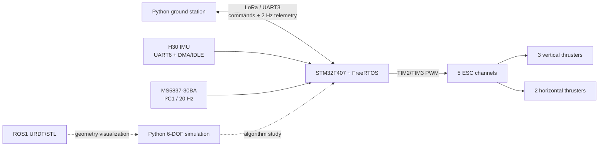

# System architecture

This page describes the repository as it exists in source code. It separates the embedded controller, the PC ground station, and the two simulation paths so that readers do not have to infer the design from archived projects.

## Embedded task model

| Task | Priority / trigger | Main responsibility |
| --- | --- | --- |
| `Task_Control` | Realtime; released by an IMU frame | Parse attitude, update speed estimate, process commands, run four PID loops, mix and write PWM |
| `Task_Depth` | Normal; nominal 50 ms loop | Read the MS5837 and update depth |
| `Task_Comms` | Below normal; receive event plus 500 ms timeout | Parse LoRa commands and send telemetry |
| `defaultTask` | Low; 500 ms loop | Heartbeat LED |

Shared robot state is protected by `Mutex_State`. Commands cross from the communication task to the control task through `Queues_Cmd`. UART IDLE interrupts release the IMU and LoRa semaphores.

## Repository-to-runtime map

| Repository path | Runtime role |
| --- | --- |
| `firmware/Core/Src/app_robot.c` | Mode state machine and real-time control loop |
| `firmware/Core/Src/pid.c` | Position-form PID and yaw-angle normalization |
| `firmware/Core/Src/mixer.c` | Five-thruster analytic mixer and normalization |
| `firmware/Core/Src/MS5837.c` | Pressure conversion and depth calculation |
| `firmware/Core/Src/analysis_data.c` | IMU binary protocol parser |
| `tools/pc/lora_pc.py` | Command console, telemetry parser, CSV logger |
| `simulation/python/` | Standalone 6-DOF numerical model and task controllers |
| `simulation/ros/simulatedrobot/` | ROS1 geometry, joints, RViz/Gazebo launch files |

## Coordinate and sign conventions

- Firmware control values use depth in metres and attitude in degrees.
- Normalized thruster commands are intended to be in `[-1, 1]`.
- The Python simulator uses body X forward, body Y left, body Z up; world depth is `-world_z`.
- The original SolidWorks-exported URDF uses its CAD export frame. Do not assume it matches the simulator body frame without applying the transform documented in `simulation/python/src/underwater_5thruster_sim/robot_params.py`.

## What is and is not validated

The physical prototype demonstrated basic motion and communication in a pool. The Python model is useful for repeatable algorithm experiments, but its hydrodynamic coefficients and thruster model are provisional. The ROS package is primarily a visualization export and does not include validated buoyancy, drag, added-mass, thruster, or sensor plugins.
