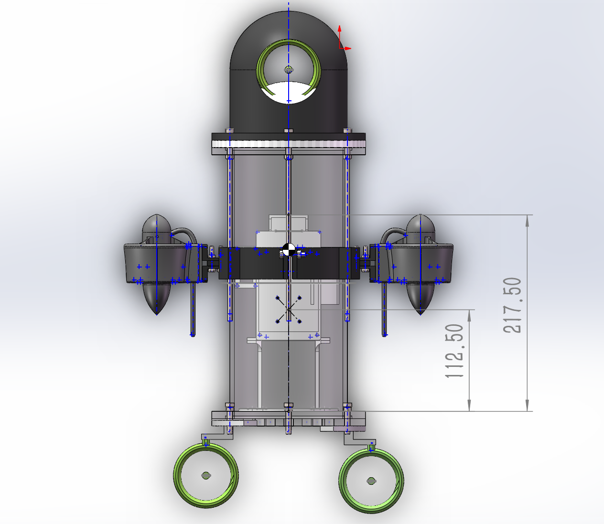

# Control algorithm

The project contains two related control implementations:

- the STM32 firmware uses four position-form PID loops and an analytic five-thruster mixer;
- the Python simulator uses model-level PD/P control, feed-forward terms, and constrained weighted least-squares allocation.

They solve the same motion tasks but are not numerically identical. Simulation gains must not be copied directly to the physical robot.

## Firmware control loop

`Task_Control` waits for a valid IMU frame. For each control update it:

1. computes the elapsed time `dt`;
2. consumes at most one queued command and updates the mode state;
3. parses attitude and updates the short-term forward-speed estimate;
4. reads the current depth and targets under the state mutex;
5. advances the square-path or turn state machine;
6. computes depth, pitch, roll, and yaw PID outputs;
7. mixes them into five normalized commands and writes PWM.

If an IMU frame does not arrive within 200 ms, all PWM channels return to neutral and all PID states are reset.

## PID implementation

For each channel:

```text
e(k) = target - measurement
I(k) = clamp(I(k-1) + e(k) dt, -Imax, Imax)
D(k) = (e(k) - e(k-1)) / dt
u(k) = clamp(Kp e(k) + Ki I(k) + Kd D(k), umin, umax)
```

A symmetric error deadband is applied before integration and differentiation. Yaw error is normalized to `[-180°, 180°]` before entering the yaw PID.

### Firmware gains

| Channel | `Kp` | `Ki` | `Kd` | Output | Integral limit | Deadband |
| --- | ---: | ---: | ---: | ---: | ---: | ---: |
| Depth | 2.0 | 0.30 | 0.50 | ±1.0 | ±0.5 | 0.01 m |
| Pitch | 1.5 | 0.10 | 0.30 | ±0.5 | ±0.3 | 0.5° |
| Roll | 1.5 | 0.10 | 0.30 | ±0.5 | ±0.3 | 0.5° |
| Yaw | 1.0 | 0.05 | 0.20 | ±0.8 | ±0.3 | 1.0° |

These are initial prototype values. There is no committed system-identification data or water-test step-response dataset that validates them across operating conditions.

## Five-thruster mixer

Let `heave`, `pitch`, `roll`, `surge`, and `yaw` be normalized control requests. With all mixer coefficients currently set to `0.5`:

```text
front_vertical     = heave + 0.5 pitch
rear_left_vertical = heave - 0.5 pitch + 0.5 roll
rear_right_vertical= heave - 0.5 pitch - 0.5 roll
left_horizontal    = surge + 0.5 yaw
right_horizontal   = surge - 0.5 yaw
```

If any absolute output exceeds 1, every output is divided by the largest magnitude. This preserves the command direction in five-dimensional actuator space, but it also couples saturation between the vertical and horizontal groups. A future implementation may normalize those groups separately or use a constrained allocator with explicit priorities.



## Modes and transitions

| Mode | Control behavior | Exit condition |
| --- | --- | --- |
| `IDLE` | Neutral PWM; reset all PID states | New command |
| `HOVER` | Hold depth and level attitude; zero surge | New command |
| `AUTO` | Hold depth and entry yaw; apply requested surge | New command |
| `TURN` | Zero surge; turn to requested yaw | Within ±3°, then switch to `HOVER` |
| `SQUARE` | Alternate timed straight legs and 90° turns | Four legs complete, then `IDLE` |

The square routine is time based. It does not measure horizontal position, so it is a demonstration sequence rather than geometric path tracking.

## Speed estimate

The firmware estimates forward speed by pitch-compensating IMU X acceleration, applying a ±0.1 m/s² deadband, integrating, decaying the result by 2% per update, and limiting it to ±3 m/s. This value is useful for short-term telemetry only; it is not a drift-free navigation measurement.

## Python simulation controller

The simulator models 6-DOF motion, linear and quadratic damping, restoring forces, actuator lag, five thrust vectors, and a weighted least-squares allocator. It provides three examples:

- depth-controlled forward motion;
- depth-controlled 90° turn;
- waypoint-guided rectangular tracking.

The simulator's very small depth errors are numerical results under assumed parameters, not measured prototype accuracy. See `simulation/python/README.md` for reproducible commands and model limitations.

## Recommended tuning order

1. Correct and calibrate the pressure-to-depth conversion.
2. Verify motor numbering, sign, neutral PWM, and emergency stop with propellers unloaded.
3. Tune pitch and roll at low output.
4. Tune depth while tethered and with a hard depth limit.
5. Tune yaw, then add low surge.
6. Validate command-loss behavior before running timed autonomous sequences.

Review [Safety and known limitations](safety.md) and [Code review findings](code-review.md) before physical testing.
